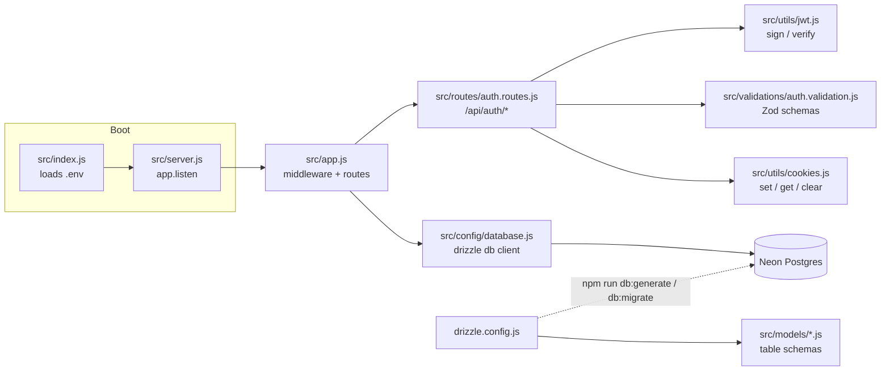

# deploy_prod_api

Building end to end CICD pipeline

## Getting Started

Install dependencies:

```
npm install
```

Run the server:

```
npm start        # node src/index.js
npm run dev      # node --watch src/index.js (auto-restarts on file changes)
```

The server listens on `PORT` (from a `.env` file) or defaults to `3000`.

Every request passes through, in order: `helmet` (security-related HTTP headers), `cors` (cross-origin request headers), `express.json()` / `express.urlencoded()` (JSON and form body parsing), `morgan` (Apache-style request logging, piped into the `winston` logger at `src/config/logger.js` — see `logs/combined.log`), and `cookieParser` (parses `req.cookies`).

## API Endpoints

| Method | Path                 | Notes                                                                                                                             |
| ------ | -------------------- | --------------------------------------------------------------------------------------------------------------------------------- |
| GET    | `/`                  | Basic hello-world route                                                                                                           |
| GET    | `/health`            | Liveness check (status + timestamp) — for uptime monitors / load balancers                                                        |
| GET    | `/api`               | Sanity-check that the API is reachable                                                                                            |
| POST   | `/api/auth/sign-up`  | Validates the body against `signUpSchema` (Zod), hashes the password, creates the user in the database, signs a JWT, and sets it as a cookie. Returns `409 { message: "User already exists" }` if the email is already registered. |
| POST   | `/api/auth/sign-in`  | Validates the body against `signInSchema` (Zod), looks up the user by email and checks the password, signs a JWT, and sets it as a cookie. Returns `401 { message: "Invalid email or password" }` for either a missing user or a wrong password (same message for both, to avoid leaking which one it was). |
| POST   | `/api/auth/sign-out` | Clears the auth cookie                                                                                                            |

Any unmatched route returns a `404 { error: "Not Found" }`. Unhandled errors passed to `next(err)` are caught by a final error-handling middleware, logged via `winston`, and returned as a generic `500 { error: "Internal Server Error" }`.

## Project Structure

- `src/index.js` — entry point; loads `.env` via `dotenv/config`, then boots `src/server.js`.
- `src/server.js` — imports the Express app from `src/app.js` and starts it with `app.listen()`.
- `src/app.js` — defines the Express app, middleware, routes, and the 404/error handlers (no server startup here).
- `src/routes/auth.routes.js` — `/api/auth/*` route definitions, wired to `signup` / `signin` / `signout` in `src/controllers/auth.controller.js`.
- `src/validations/auth.validation.js` — Zod schemas (`signUpSchema`, `signInSchema`) describing expected request bodies; applied in `signup` and `signin` respectively (`src/controllers/auth.controller.js`).
- `src/services/auth.service.js` — `createUser()` (checks for a duplicate email, hashes the password, inserts the row) and `authenticateUser()` (looks up by email, verifies the password with `comparePassword()`), both against the `users` table via Drizzle/Neon.
- `src/utils/jwt.js` — `jwt_token.sign()` / `jwt_token.verify()` wrap `jsonwebtoken` to issue/validate tokens against `JWT_SECRET`; used by `signup` and `signin` (`src/controllers/auth.controller.js`) to sign the auth cookie's token.
- `src/utils/cookies.js` — `cookies.set/get/clear` helpers with shared cookie defaults (httpOnly, secure in production, 24h maxAge); `set` is used by `signup`/`signin` to store the JWT, `clear` is used by `signout`.
- `src/utils/format.js` — `formatValidationErrors()` turns a Zod validation error into a single readable string.
- `src/config/database.js` — creates the Neon SQL client and the Drizzle `db` instance used to query it.
- `src/models/` — Drizzle table schema definitions (picked up by `drizzle-kit` for migrations). Currently: `users` (id, name, email, password, role, timestamps).
- `drizzle.config.js` — `drizzle-kit` configuration: where schema files live, where generated migrations go, and the DB connection string.
- `src/config/logger.js` — a `winston` logger (file transports for errors/combined logs, plus console output outside production).

## Import Aliases

This project uses Node's [subpath imports](https://nodejs.org/api/packages.html#subpath-imports) (the `imports` field in `package.json`) so internal modules can be imported by alias instead of relative paths:

```js
import logger from '#config/logger.js';
```

Available aliases (each maps `#name/*` → `./src/name/*`): `#config`, `#controllers`, `#models`, `#routes`, `#utils`, `#validate`, `#services`, `#middleware`.

## Architecture



Request flow: `index.js` loads env vars → `server.js` starts the HTTP server around the app defined in `app.js` → middleware runs → route handlers respond. `/api/auth/sign-up` validates its body against `signUpSchema`, calls `createUser` (`src/services/auth.service.js`) to check for an existing user, hash the password, and insert the new user via Drizzle/Neon, then signs a JWT via `jwt_token.sign` (`src/utils/jwt.js`) and sets it as a cookie via `cookies.set`; a duplicate email returns `409 { message: "User already exists" }`. `/api/auth/sign-in` validates its body against `signInSchema`, calls `authenticateUser` to look up the user by email and verify the password, then signs/sets the same kind of JWT cookie; a missing user or wrong password both return `401 { message: "Invalid email or password" }`. `/api/auth/sign-out` clears the auth cookie via `cookies.clear`. Migrations are managed separately via `drizzle-kit` (`npm run db:generate`, `npm run db:migrate`, `npm run db:studio`), driven by `drizzle.config.js`.

## Database (Neon + Drizzle)

This project uses [Neon](https://neon.tech) (serverless Postgres) as the database and [Drizzle ORM](https://orm.drizzle.team) to query it.

1. Copy `.env.example` to `.env` and set `Database_URL` to your Neon connection string.
2. Define tables as Drizzle schemas under `src/models/`.
3. Generate and run migrations:

```
npm run db:generate    # generate SQL migrations from src/models/ schema
npm run db:migrate     # apply migrations to the database
npm run db:studio      # open Drizzle Studio to browse data
```

> Note: the env var is currently named `Database_URL` (mixed case) in `.env.example` and read the same way in `src/config/database.js` / `drizzle.config.js` — it works, but doesn't follow the conventional `UPPER_SNAKE_CASE` env var naming.

## Linting & Formatting

ESLint (`@eslint/js` recommended rules) plus Prettier are configured via `eslint.config.js`.

```
npm run lint           # check for lint/formatting issues
npm run lint:fix        # auto-fix what it can
npm run format          # apply Prettier formatting
npm run format:check    # check formatting without writing changes
```
