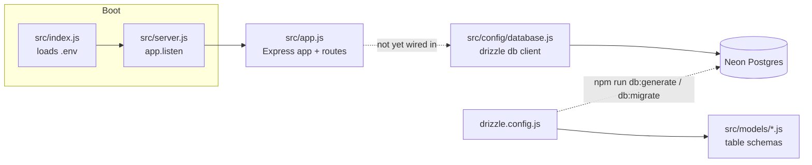

# deploy_prod_api

Building end to end CICD pipeline

## Getting Started

Install dependencies:

```
npm install
```

Run the server:

```
npm start        # node src/index.js
npm run dev      # node --watch src/index.js (auto-restarts on file changes)
```

The server listens on `PORT` (from a `.env` file) or defaults to `3000`.

Every request passes through: `helmet` (security-related HTTP headers), `express.json()` / `express.urlencoded()` (JSON and form body parsing), and `morgan` (Apache-style request logging, piped into the `winston` logger at `src/config/logger.js` — see `logs/combined.log`).

## Project Structure

- `src/index.js` — entry point; loads `.env` via `dotenv/config`, then boots `src/server.js`.
- `src/server.js` — imports the Express app from `src/app.js` and starts it with `app.listen()`.
- `src/app.js` — defines the Express app, middleware (`helmet`, `morgan`), and routes (no server startup here).
- `src/config/database.js` — creates the Neon SQL client and the Drizzle `db` instance used to query it.
- `src/models/` — Drizzle table schema definitions (picked up by `drizzle-kit` for migrations).
- `drizzle.config.js` — `drizzle-kit` configuration: where schema files live, where generated migrations go, and the DB connection string.
- `src/config/logger.js` — a `winston` logger (file transports for errors/combined logs, plus console output outside production).

## Import Aliases

This project uses Node's [subpath imports](https://nodejs.org/api/packages.html#subpath-imports) (the `imports` field in `package.json`) so internal modules can be imported by alias instead of relative paths:

```js
import logger from '#config/logger.js';
```

Available aliases (each maps `#name/*` → `./src/name/*`): `#config`, `#controllers`, `#models`, `#routes`, `#utils`, `#validate`, `#services`, `#middleware`.

## Architecture



Request flow: `index.js` loads env vars → `server.js` starts the HTTP server around the app defined in `app.js` → route handlers respond to requests. The database layer (`config/database.js`, using Drizzle + the Neon serverless driver) is set up but not yet called from any route — once a route imports `db` from `src/config/database.js`, it can query Neon Postgres using schemas defined in `src/models/`. Migrations are managed separately via `drizzle-kit` (`npm run db:generate`, `npm run db:migrate`, `npm run db:studio`), driven by `drizzle.config.js`.

## Database (Neon + Drizzle)

This project uses [Neon](https://neon.tech) (serverless Postgres) as the database and [Drizzle ORM](https://orm.drizzle.team) to query it.

1. Copy `.env.example` to `.env` and set `Database_URL` to your Neon connection string.
2. Define tables as Drizzle schemas under `src/models/`.
3. Generate and run migrations:

```
npm run db:generate    # generate SQL migrations from src/models/ schema
npm run db:migrate     # apply migrations to the database
npm run db:studio      # open Drizzle Studio to browse data
```

> Note: the env var is currently named `Database_URL` (mixed case) in `.env.example` and read the same way in `src/config/database.js` / `drizzle.config.js` — it works, but doesn't follow the conventional `UPPER_SNAKE_CASE` env var naming.

## Linting & Formatting

ESLint (`@eslint/js` recommended rules) plus Prettier are configured via `eslint.config.js`.

```
npm run lint           # check for lint/formatting issues
npm run lint:fix        # auto-fix what it can
npm run format          # apply Prettier formatting
npm run format:check    # check formatting without writing changes
```
